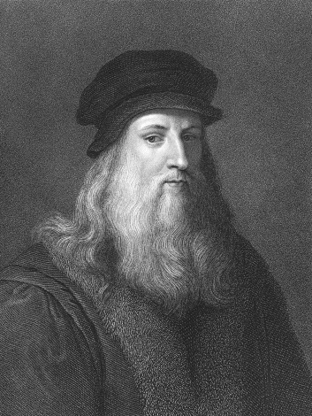

# Davinci Dataset
<p align='center'>

<p>
  
## Introduction
As we all know, Leonardo Da Vinci was a talented scientists in lots of areas, such as physics, math, art, and etc. I'd like to build a pretrained GPT model like Davinci to help human accelerate basic science like physics and math. This is the dataset for the GPT model.

## ToDo
- [x] Physics
- [x] Math
- [ ] Art
- [ ] Philosiphy

## Dateset Preview
```
Gauge theory
Introduction
The discovery of gauge theory is effectively the discovery of groupoids in fundamental physics. The notion of gauge transformation is close to synonymous to the notion isomorphism and more generally to equivalence in an (∞,1)-category .
From a modern point of view, the mathematical model for a gauge field in physics is a cocycle in (nonabelian) differential cohomology: a principal bundle with connection and its higher analogs. These naturally do not form just a set, but a groupoid and generally an ∞-groupoid, whose morphisms are gauge transformations, and higher morphisms are gauge-of-gauge transformations. The development of differential cohomology has to a fair extent been motivated by and influenced by its application to fundamental theoretical physics in general and gauge theory in particular.
Around 1850 Maxwell realized that the field strength of the electromagnetic field is modeled by what today we call a closed differential 2-form on spacetime. In the 1930s Dirac observed that more precisely this 2-form is the curvature 2-form of a U(1)-principal bundle with connection, hence that the electromagnetic field is modeled by what today is called a degree 2-cocycle in ordinary differential cohomology .
Meanwhile, in 1915, Einstein had identified also the field strength of the field of gravity as the 𝔰𝔬(d,1)\mathfrak{so}(d,1)-valued curvature 2-form of the canonical O(d,1)-principal bundle with connection on a d+1d+1-dimensional spacetime Lorentzian manifold. This is a cocycle in differential nonabelian cohomology: in Chern-Weil theory.
In the 1950s Yang-Mills theory identified the field strength of all the gauge fields in the standard model of particle physics as the 𝔲(n)\mathfrak{u}(n)-valued curvature 2-forms of U(n)-principal bundles with connection. This is again a cocycle in differential nonabelian cohomology.

Entities of ordinary gauge theory
Lie algebra𝔤\mathfrak{g} with gauge Lie group GG – connection with values in 𝔤\mathfrak{g} on GG-principal bundle over a smooth manifold XX.
```
